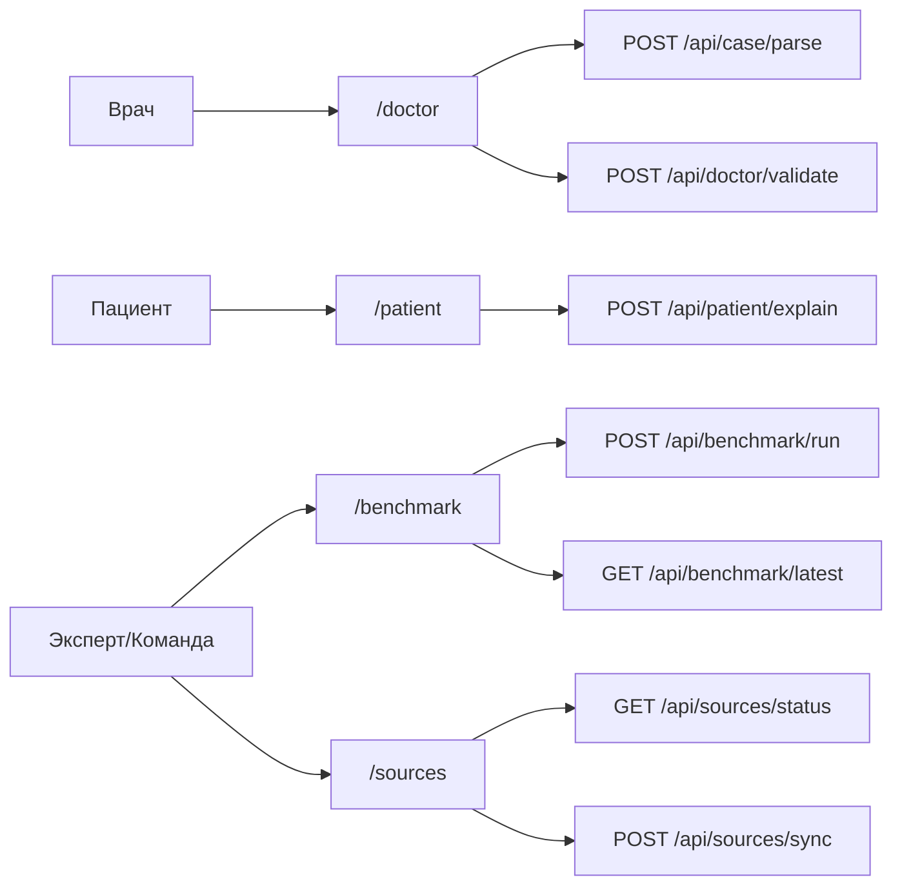
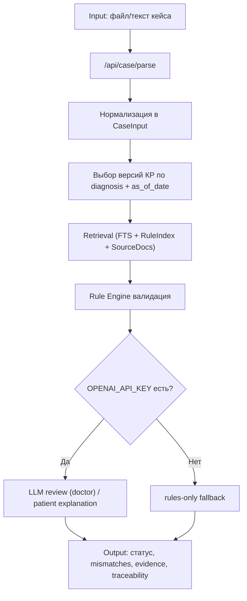
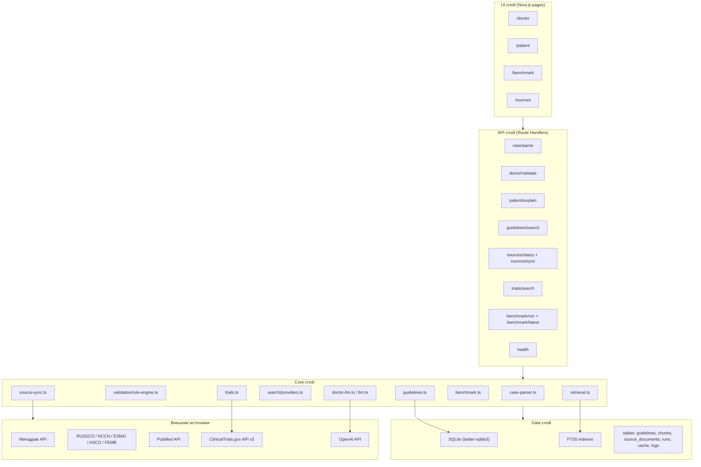
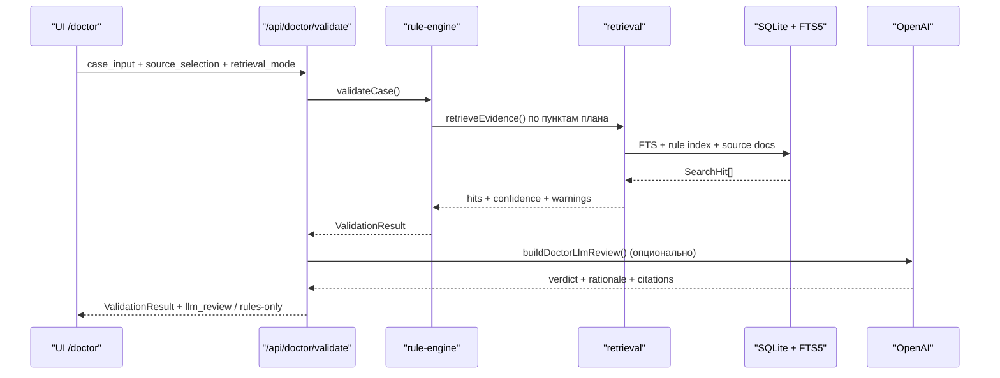
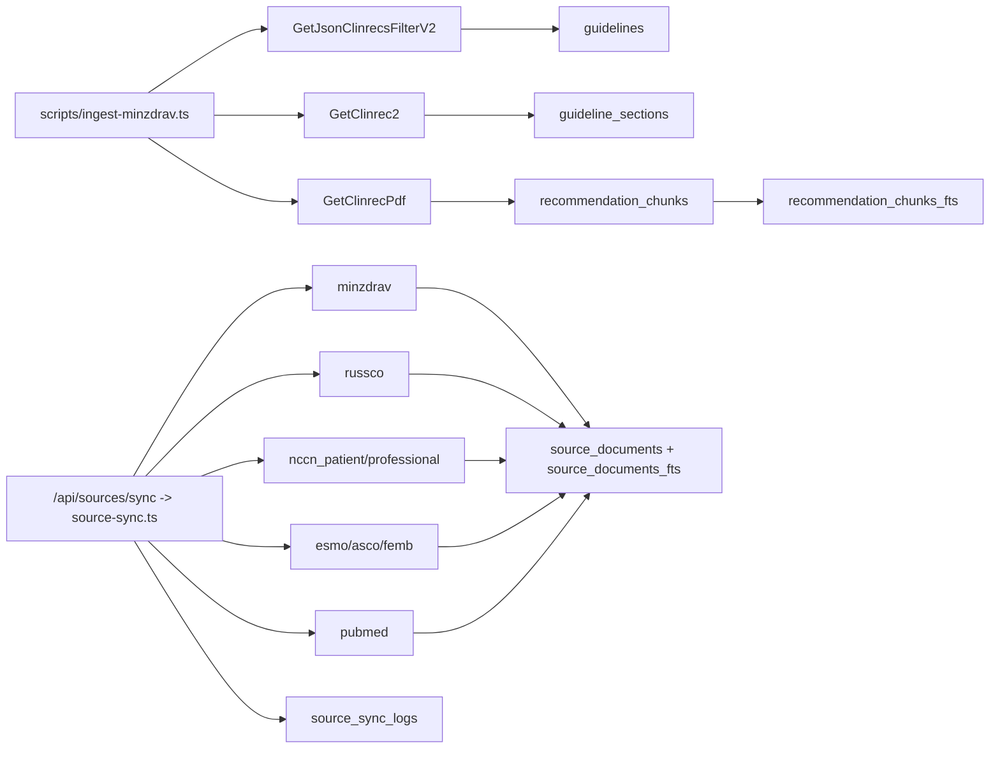
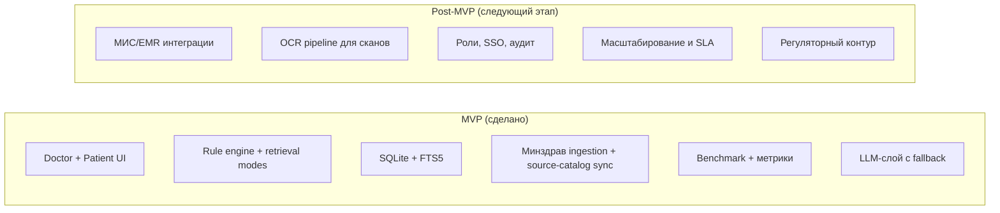

# Схемы MVP: как работает система и что под капотом

Дата: 2026-02-24

## 1) Продуктовый контур (что видят пользователи)

## 2) Сквозной pipeline проверки кейса (Input -> Process -> Output)

## 3) Что под капотом: слои системы

## 4) Sequence для `/api/doctor/validate`

## 5) Data ingestion и source sync

## 6) Граница MVP vs Post-MVP (для слайда)

## Как использовать в презентации
- Слайд 1-2: схема 1.
- Слайд 3: схема 2.
- Слайд 5-6: схема 3 + схема 4.
- Слайд 4 и 8: схема 5.
- Слайд 9: схема 6.
